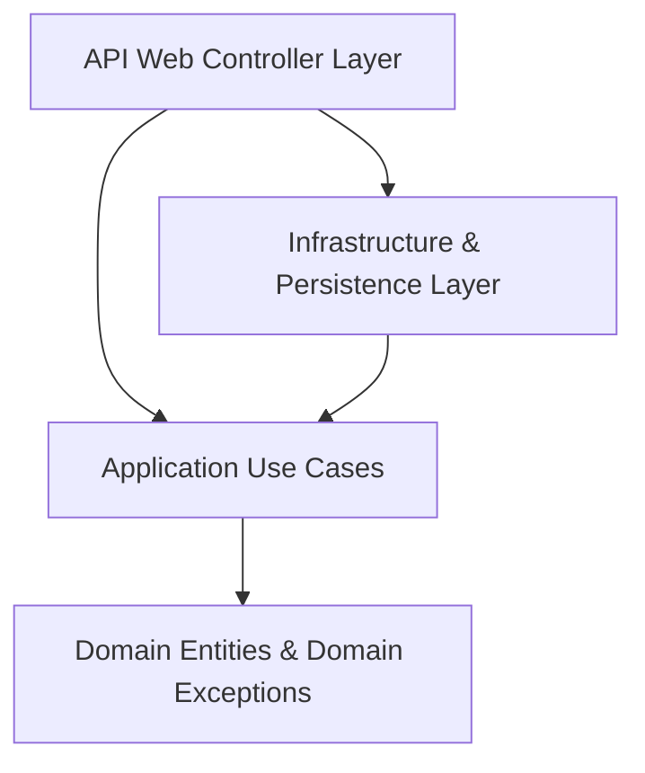

# GestionEspaces - Workspace & Asset Management System

`GestionEspaces` is a complete workspace, desk, and asset management solution built for modern enterprises. It is designed using **Clean Architecture** patterns, leveraging a robust **ASP.NET Core Web API** backend connected to **SQL Server**, paired with a fast and responsive **React** frontend (powered by **Vite** and **Tailwind CSS v4**).

---

## 🏢 Table of Contents
1. [Key Features](#-key-features)
2. [Architectural Overview](#-architectural-overview)
3. [Prerequisites](#-prerequisites)
4. [Getting Started (Local Launch)](#-getting-started-local-launch)
5. [Database Seeding & Test Credentials](#-database-seeding--test-credentials)
6. [Testing the Codebase](#-testing-the-codebase)
7. [GitHub Deployment Steps](#-github-deployment-steps)

---

## 🌟 Key Features

*   **Role-Based Security (JWT)**: Fully secured API endpoints with dynamic authentication rules.
    *   `Lecteur` role: Permissions to read/query workspaces, agents, assets, and bookings.
    *   `Gestionnaire` role: Full mutate permissions (Create, Edit, Delete, Assign, Validate).
*   **Workspace Management**: Hierarchical modeling of Sites, Buildings, and Office Desks (Bureaux).
*   **Asset Tracking**: Equipment inventory management (computers, screens, accessories) with real-time condition tags.
*   **Desk & Asset Assignments**: Permanent attribution of offices or hardware to agents, complete with historical closure dates.
*   **Room/Desk Reservations**: Temporary booking system with built-in time-window overlap validation constraints to prevent double-booking.
*   **Optimistic Concurrency Control**: Uses SQL Server `rowversion` tokens to prevent concurrent save conflicts, throwing explicit `409 Conflict` errors on API level.

---

## 🏗 Architectural Overview

The backend follows the **Clean Architecture** dependency rule (Dependencies point inwards: API → Infrastructure → Application → Domain).



### 📂 Directory Structure

```
├── GestionEspaces/                   # Backend Solution Root
│   ├── GestionEspaces.Domain/        # Domain entities, value objects, exceptions, and rules
│   ├── GestionEspaces.Application/   # DTOs, Repository interfaces, Use cases, Validators
│   ├── GestionEspaces.Infrastructure/# DbContext, EF Configurations, Repositories, JWT Auth token generation
│   ├── GestionEspaces.Api/           # Web API Controllers, program bootstrap, middlewares
│   ├── GestionEspaces.Tests/         # Unit Tests (xUnit)
│   ├── GestionEspaces.IntegrationTests/ # Integration Tests (Testcontainers + SQL Server)
│
├── GestionEspaces.Web/               # React Web Application Root
│   ├── src/
│   │   ├── components/               # Layouts, Sidebars, and generic components
│   │   ├── pages/                    # Screens (Dashboard, Sites, Spaces, Agents, Assets, Reservations)
│   │   ├── services/                 # Axios API service configuration
│   │   ├── context/                  # AuthContext (JWT management, persistence, role claims)
│   │   ├── hooks/                    # Custom React hooks (useAuth)
│   │   └── index.css                 # Theme configurations using Tailwind CSS v4 variables
│   ├── package.json
│   └── vite.config.js
```

---

## 🛠 Prerequisites

Make sure you have the following installed on your machine:
1.  **[.NET 10.0 SDK](https://dotnet.microsoft.com/download/dotnet/10.0)**
2.  **[Node.js](https://nodejs.org/)** (v18 or higher recommended)
3.  **[SQL Server](https://www.microsoft.com/sql-server/)** or **SQL Server LocalDB**

---

## 🚀 Getting Started (Local Launch)

### 1. Database Setup

Update the connection string in `GestionEspaces.Api/appsettings.json` (or `appsettings.Development.json`) to point to your local SQL Server instance:

```json
"ConnectionStrings": {
  "GestionEspacesDatabase": "Server=localhost\\SQLEXPRESS;Database=GestionEspacesDb;Trusted_Connection=True;TrustServerCertificate=True;MultipleActiveResultSets=true"
}
```

Open a shell terminal at the repository root (`D:\downloads\gestion_des_espaces`) and apply migrations:

```powershell
Set-Location .\GestionEspaces
dotnet ef database update --project .\GestionEspaces.Infrastructure\GestionEspaces.Infrastructure.csproj --startup-project .\GestionEspaces.Api\GestionEspaces.Api.csproj
```

### 2. Launching the Backend API

Run the API project:

```powershell
dotnet run --project GestionEspaces.Api/GestionEspaces.Api.csproj
```
The server will boot and start listening on: **`http://localhost:5153`**. You can view Swagger API documentation at `http://localhost:5153/swagger`.

### 3. Launching the React Frontend

Open a new shell terminal at the web directory root (`/GestionEspaces.Web`):

```powershell
# Install Node dependencies
npm install

# Start the Vite development server
npm run dev
```
The frontend will start running and print the address: **`http://localhost:5173`**. Open this link in your web browser.

---

## 👥 Database Seeding & Test Credentials

On the first application run, the system automatically deletes any pre-existing records and seeds a comprehensive Moroccan-themed set of mock data (based on the National Office of Electricity - ONEE Casablanca). 

To sign in, use the following sample accounts:

| Email | Password | Role | Privileges |
| :--- | :--- | :--- | :--- |
| **`admin.gestion@test.fr`** | *(Any)* | **Gestionnaire** | Full write/create/delete access |
| **`lecteur@test.fr`** | *(Any)* | **Lecteur** | Read-only access |

---

## 🧪 Testing the Codebase

To run all backend unit tests:

```powershell
dotnet test
```

*   **Unit Tests** (`GestionEspaces.Tests`): Validates domain rule invariants, reservation overlap conditions, and domain exceptions.
*   **Integration Tests** (`GestionEspaces.IntegrationTests`): Uses `Testcontainers` to dynamically boot a temporary Docker SQL Server instance to execute end-to-end CRUD controller testing.

---

## 🐙 GitHub Deployment Steps

If you want to push this project to your own GitHub repository, open a terminal at the project workspace root and execute:

```powershell
# 1. Initialize a local git repository
git init

# 2. Add all files to staging (uses the existing .gitignore)
git add .

# 3. Create initial commit
git commit -m "Initial commit: Complete GestionEspaces workspace management system"

# 4. Rename default branch to main
git branch -M main

# 5. Link your GitHub remote repository (replace with your repository link)
git remote add origin https://github.com/YOUR_USERNAME/YOUR_REPO_NAME.git

# 6. Push code to remote repository
git push -u origin main
```

---

> [!NOTE]
> If you pull new updates from remote, ensure you restart both development servers to compile new schema modifications.
